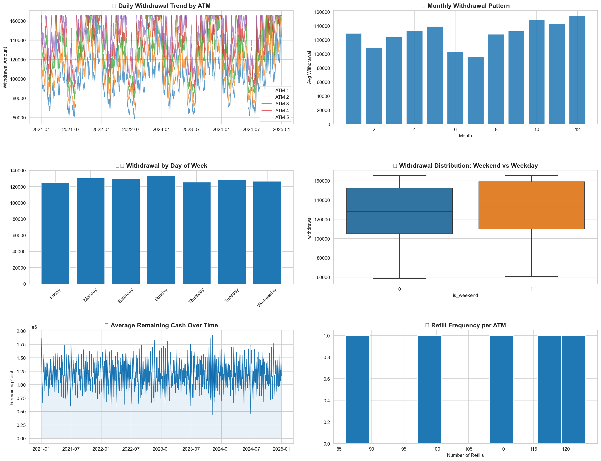
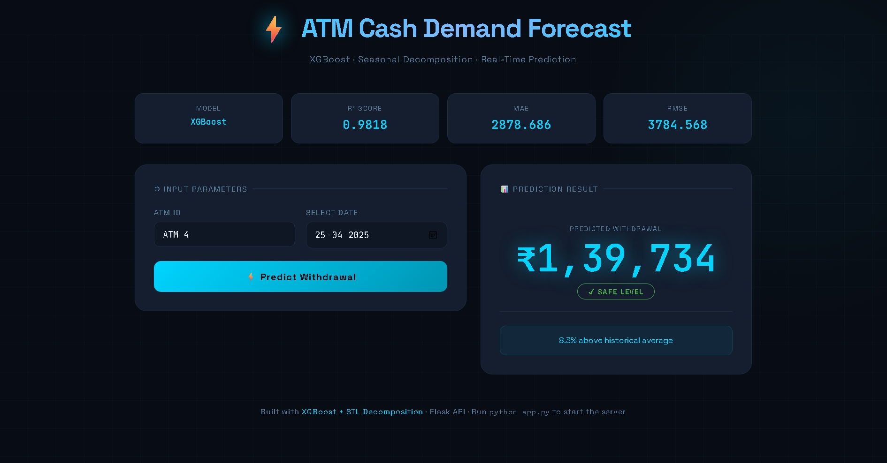
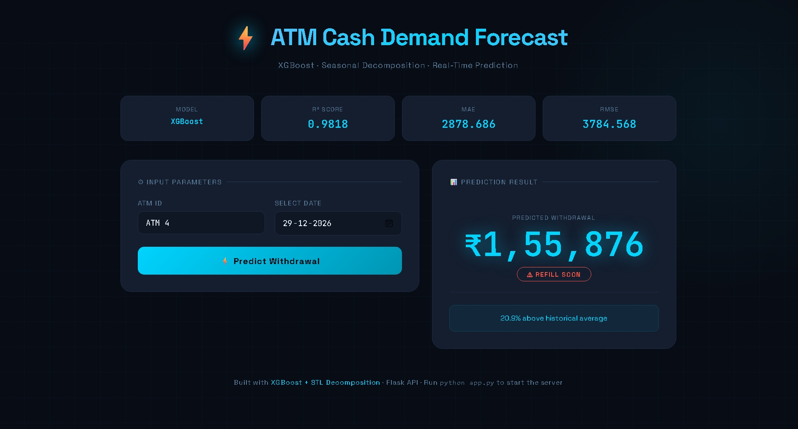

# ATM-Cash-Demand-Forecasting-System


##  Project Overview

This project predicts future ATM cash withdrawal demand using a machine learning model. The goal is to help banks optimize cash refill schedules, reduce shortages, and improve operational efficiency.

The system uses historical ATM withdrawal data and generates predictions based on calendar patterns, lag values, and rolling statistics.

A Flask-based web application allows users to select an ATM and date to generate real-time predictions.

---

##  Key Features

-  Date-based ATM cash demand prediction
-  Machine Learning model using XGBoost
-  Lag and rolling statistical features
-  High prediction accuracy (R² ≈ 0.98)
-  Flask web interface for real-time forecasting
-  Docker support for deployment
-  Demand level classification (Safe / Refill Soon)
-  Historical comparison insights

---

#  Machine Learning Model Details

**Model Used:** XGBoost Regressor  

**Feature Types:**

### Calendar Features
- month
- day_of_week
- day_of_month
- is_weekend
- is_month_start
- is_month_end
- is_payday
- is_holiday
- lag features 
- Rolling features

---

##  Model Performance Metrics



| Metric | Value |
|-------|------|
| R² Score | 0.9818 |
| RMSE | 3784.56 |
| MAE | 2878.68 |
| MAPE | 2.33% |

These results indicate strong predictive performance suitable for operational forecasting tasks.

---

##  Input Requirements

The model requires:

- **ATM ID**
- **Date** for prediction

The system automatically calculates lag and rolling features from historical data.

---

##  Output Example

```
Predicted Withdrawal: ₹1,50,712
Demand Level: ⚠ Refill Soon
Insight: 17.2% above historical average
```

---

##  Running the Application (Local)

### Step 1 — Install Dependencies

```
pip install -r requirements.txt
```

### Step 2 — Run Flask App

```
python app.py
```

Open in browser:

```
http://localhost:5000
```

---

##  Running with Docker

### Build Image

```
docker build -t atm-forecaster .
```

### Run Container

```
docker run -p 5000:5000 atm-forecaster
```

Access:

```
http://localhost:5000
```

---

##  API Endpoints

### Predict Endpoint

**POST** `/predict`

### Request Example

```
{
  "atm_id": 1,
  "date": "2025-08-15"
}
```

### Response Example

```
{
  "prediction": 150712,
  "level": "⚠ Refill Soon",
  "level_color": "#F44336",
  "insight": "17.2% above historical average"
}
```

---

##  Health Check Endpoint

**GET** `/health`

Returns system status, model state, and metadata.

---

##  Dataset Description

The historical dataset contains:

| Column | Description |
|-------|-------------|
| date | Transaction date |
| atm_id | ATM identifier |
| withdrawal | Cash withdrawn amount |

---

##  Use Cases

- ATM cash refill planning
- Demand forecasting
- Banking operations optimization
- Resource planning
- Cash logistics management

---

##  Technologies Used

- Python 
- Pandas
- NumPy
- XGBoost
- Time-series analysis
- Flask
- HTML / CSS / JavaScript
- Docker

## Site Preview

### Safe Level 



### Need to Refill



---
